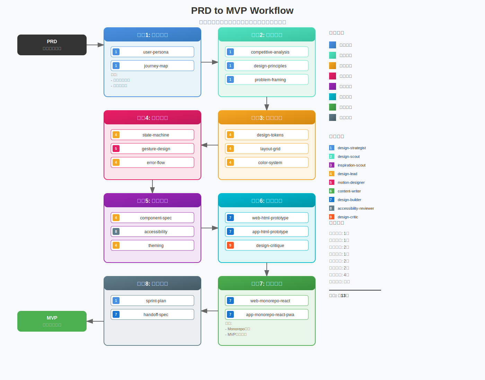
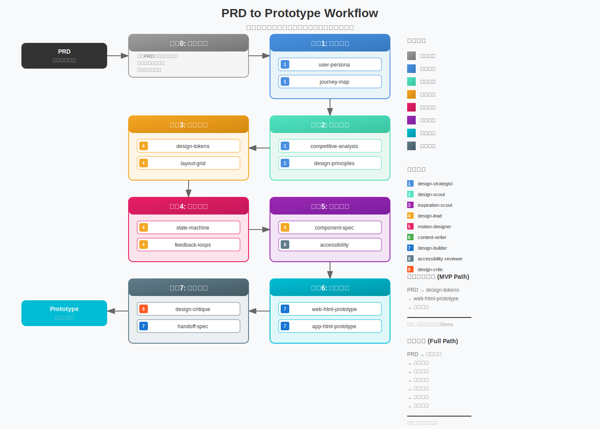
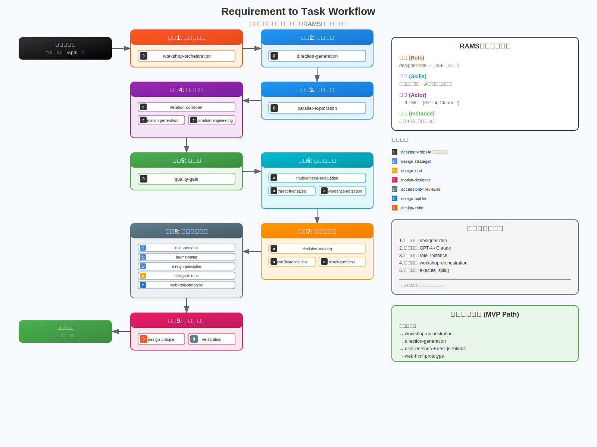

# Open Design

一个完整的 AI 辅助设计系统框架，从 PRD 到 MVP 的全流程设计规范和工具链。

## 📖 简介

Open Design 是一套系统化的设计方法论和工具链，旨在帮助团队从产品需求文档（PRD）高效地构建最小可行产品（MVP）。它提供了从用户研究、策略制定、设计系统、交互设计到开发交付的完整流程规范，以及配套的 AI Skills 工具链。

## ✨ 特性

### 🎯 全流程覆盖

- **研究阶段**：用户画像、旅程地图、访谈脚本、可用性测试
- **策略阶段**：竞品分析、设计原则、问题框架化
- **设计阶段**：设计令牌、布局网格、色彩系统、排版系统
- **交互阶段**：状态机、手势设计、错误流程、反馈机制
- **系统阶段**：组件规格、无障碍设计、主题系统
- **原型阶段**：HTML 高保真原型
- **开发阶段**：Monorepo React 项目架构
- **运营阶段**：设计评审、交付规范、冲刺计划

### 🤖 AI Skills 工具链

集成 Claude Skills 系统，提供专业的设计辅助能力：

- **designer-role**：扮演专业设计师角色，完成从用户研究到产品设计的全流程任务
- **web-html-prototype**：Web 应用 HTML 原型设计
- **app-html-prototype**：App 应用 HTML 原型设计
- **web-monorepo-react**：Web 应用 Monorepo React 开发
- **app-monorepo-react-pwa**：App 应用 Monorepo React PWA 开发

### 🔄 Workflow 系统

基于 Windsurf 的自动化工作流系统，提供三种核心 workflow：

- **prd-to-mvp**：从 PRD 到 MVP 的完整实施计划（8个阶段，约13周）
- **prd-to-prototype**：从 PRD 到原型的技能使用指南（快速验证设计假设）
- **requirement-to-task**：从一句话需求到任务完成的 RAMS 框架指南（AI工作坊编排）

#### Workflow 可视化







### � 设计系统规范

基于分层架构的设计文档体系：

- **DESIGN-SPEC.md**：设计系统的单一事实来源（SSOT），兼容 Google DESIGN.md 规范
- **RESEARCH-SPEC.md**：用户研究和数据收集规范
- **STRATEGY-SPEC.md**：产品策略和设计方向规范
- **INTERACTION-SPEC.md**：交互设计和行为定义规范
- **OPS-SPEC.md**：设计运营和团队协作规范

### 🎨 设计令牌系统

完整的 TypeScript 设计令牌，支持：

- 颜色系统（品牌色、背景色、文本色、功能色）
- 排版系统（字号、字重、行高、字间距）
- 间距系统（4px 基准网格）
- 圆角系统（4px 基准）
- 阴影系统（层级深度）
- 过渡系统（动画时长）
- Z-index 系统（层级管理）
- 断点系统（响应式设计）

### ♿ 无障碍设计

遵循 WCAG 2.2 AA 标准，确保：

- 色彩对比度符合标准
- 键盘导航完整
- 屏幕阅读器支持
- ARIA 标签规范
- 触控目标尺寸

### 🌓 主题系统

基于 CSS 变量的主题系统，支持：

- 深色主题（默认）
- 浅色主题（待实现）
- 自定义主题（待实现）
- 主题切换功能

## 📁 项目结构

```
open-design/
├── .claude/              # Claude Skills 工具链
│   └── skills/
│       └── designer-role/
│           └── skills/   # 设计相关 Skills
├── .windsurf/            # Workflow 系统
│   └── workflows/        # Workflow 文件
│       ├── prd-to-mvp.md
│       ├── prd-to-prototype.md
│       └── requirement-to-task.md
├── docs/                 # 设计规范文档
│   ├── DESIGN-SPEC.md
│   ├── RESEARCH-SPEC.md
│   ├── STRATEGY-SPEC.md
│   ├── INTERACTION-SPEC.md
│   ├── OPS-SPEC.md
│   ├── INDEX.md
│   ├── WORKFLOW_GUIDE.md
│   ├── RAMS_FRAMEWORK.md
│   └── ROLE_INSTANTIATION_GUIDE.md
├── demo/                 # 示例项目
│   └── role/             # Fambulator 示例（gitignore）
├── packages/             # 共享包
├── templates/            # 文档模板
│   ├── DESIGN-SPEC.md
│   ├── USER-PERSONA.md
│   ├── JOURNEY-MAP.md
│   ├── INTERVIEW-SCRIPT.md
│   ├── DESIGN-PRINCIPLES.md
│   ├── COMPETITIVE-ANALYSIS.md
│   ├── PROBLEM-FRAMING.md
│   ├── COLOR-SYSTEM.md
│   ├── LAYOUT-GRID.md
│   ├── TYPOGRAPHY-SYSTEM.md
│   ├── DESIGN-SYSTEMS.md
│   ├── INTERACTION-DESIGN.md
│   ├── STATE-MACHINE.md
│   ├── ERROR-FLOW.md
│   ├── COMPONENT-SPEC.md
│   ├── ACCESSIBILITY.md
│   ├── THEMING.md
│   ├── WORKSHOP-ORCHESTRATION.md
│   ├── PARALLEL-EXPLORATION.md
│   └── ITERATION-CONTROLLER.md
└── ref/                  # 参考资料
```

## 🚀 快速开始

### 使用设计规范

1. 阅读 [docs/INDEX.md](docs/INDEX.md) 了解文档架构
2. 根据项目阶段选择对应的规范文档
3. 使用 `templates/` 目录下的模板创建文档

### 使用文档模板

`templates/` 目录提供了19个标准化的文档模板，按设计阶段分类：

- **研究类**：USER-PERSONA.md, JOURNEY-MAP.md, INTERVIEW-SCRIPT.md
- **策略类**：DESIGN-PRINCIPLES.md, COMPETITIVE-ANALYSIS.md, PROBLEM-FRAMING.md
- **设计类**：COLOR-SYSTEM.md, LAYOUT-GRID.md, TYPOGRAPHY-SYSTEM.md, DESIGN-SYSTEMS.md
- **交互类**：INTERACTION-DESIGN.md, STATE-MACHINE.md, ERROR-FLOW.md
- **系统类**：COMPONENT-SPEC.md, ACCESSIBILITY.md, THEMING.md
- **编排类**：WORKSHOP-ORCHESTRATION.md, PARALLEL-EXPLORATION.md, ITERATION-CONTROLLER.md

### 使用 AI Skills

1. 确保安装 Claude AI 助手
2. 在 `.claude/skills/` 目录下配置 Skills
3. 通过对话调用相应的 Skill

### 使用 Workflow

1. 阅读 [docs/WORKFLOW_GUIDE.md](docs/WORKFLOW_GUIDE.md) 了解 workflow 系统
2. 根据项目需求选择合适的 workflow：
   - 有完整 PRD → 使用 `prd-to-mvp` 或 `prd-to-prototype`
   - 只有一句话需求 → 使用 `requirement-to-task`
3. 通过 Windsurf UI 或命令行执行 workflow

### 查看 Fambulator 示例

1. 查看 `demo/monorepo/prd.md` 了解产品需求
2. 浏览 `demo/monorepo/docs/` 查看阶段性文档
3. 打开 `demo/monorepo/prototypes/` 查看 HTML 原型

## 📖 文档

- [设计规范索引](docs/INDEX.md) - 所有规范文档的总索引
- [Workflow 使用指南](docs/WORKFLOW_GUIDE.md) - 如何使用 Open Design 的 workflow 系统
- [RAMS 框架文档](docs/RAMS_FRAMEWORK.md) - Role-Actor Marketplace System 框架说明
- [角色实例化指南](docs/ROLE_INSTANTIATION_GUIDE.md) - 如何实例化和使用设计角色

## 🤝 贡献

欢迎贡献！请查看 [docs/INDEX.md](docs/INDEX.md) 中的贡献指南。

## 📄 许可证

本项目采用 MIT 许可证 - 详见 [LICENSE](LICENSE) 文件

## 🙏 致谢

本项目受到以下项目的启发：

- **[Google DESIGN.md](https://github.com/google/design.md)** - 设计系统规范的单一事实来源概念和 YAML front matter 格式
- **[Owl-Listener/ai-design-skills](https://github.com/Owl-Listener/ai-design-skills)** - AI 辅助设计工具链的设计理念和实现方式

感谢这些开源项目为设计系统领域做出的贡献。

## 🔗 相关资源

- [W3C Design Token Format](https://www.designtokens.org/)
- [WCAG 2.2](https://www.w3.org/WAI/WCAG22/quickref/)
- [Google DESIGN.md](https://github.com/google/design.md)


