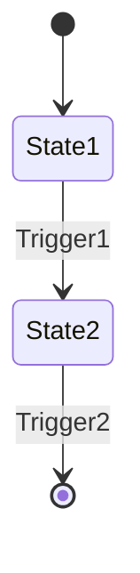
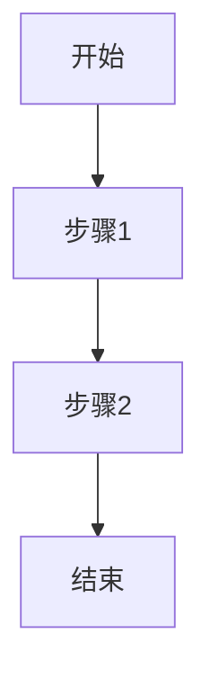

# 交互类文档规范

## 概述

本文档定义了 Open Design 项目中所有交互类文档的格式、结构和内容要求。交互类文档包括状态机图、交互流程图、原型文件和交互规范。

## 文档类型

### 1. 状态机图 (State Machine)

#### 文件命名
- 格式：`state-machine-[component].md`
- 示例：`state-machine-button.md`

#### 必需字段

```markdown
---
component_name: [组件名称]
state_count: [状态数量]
created_date: [创建日期]
---

# 状态机：[组件名称]

## 状态定义

### State 1: [状态名称]
- **描述**：[状态的详细描述]
- **进入条件**：[进入此状态的条件]
- **退出条件**：[退出此状态的条件]
- **行为**：[此状态下的行为]

### State 2: [状态名称]
- [同上]

## 转换定义

### Transition 1: [转换名称]
- **从状态**：[源状态]
- **到状态**：[目标状态]
- **触发条件**：[触发转换的条件]
- **动作**：[转换时执行的动作]

### Transition 2: [转换名称]
- [同上]

## 状态机图


## 心理学原则应用
- [状态设计如何应用心理学原则]

## 可访问性考虑
- [状态变化如何通知辅助技术]
```

#### 质量标准

- **完整性**：覆盖所有可能的状态
- **清晰性**：状态和转换定义清晰
- **可达性**：从任何状态都能到达有效状态
- **可测试性**：状态机可以被测试

### 2. 交互流程图 (Interaction Flow)

#### 文件命名
- 格式：`interaction-flow-[feature].md`
- 示例：`interaction-flow-checkout.md`

#### 必需字段

```markdown
---
flow_name: [流程名称]
feature: [功能名称]
step_count: [步骤数量]
created_date: [创建日期]
---

# 交互流程：[流程名称]

## 流程概述
- [流程的简要描述]

## 用户目标
- [用户通过此流程要达到的目标]

## 前置条件
- [开始流程前需要满足的条件]

## 流程步骤

### 步骤1：[步骤名称]
- **用户行为**：[用户的具体行为]
- **系统响应**：[系统的响应]
- **下一步**：[下一步骤或结束]
- **异常处理**：[异常情况的处理]

### 步骤2：[步骤名称]
- [同上]

## 流程图


## 决策点

### 决策1：[决策名称]
- **条件**：[决策条件]
- **分支A**：[条件满足时的路径]
- **分支B**：[条件不满足时的路径]

## 错误处理
- [各种错误情况的处理方式]

## 心理学原则应用
- [流程设计如何应用心理学原则]
- **菲茨定律**：[应用说明]
- **希克定律**：[应用说明]
- **认知负荷**：[应用说明]

## 可访问性考虑
- [键盘导航]
- [屏幕阅读器支持]
- [错误提示]
```

#### 质量标准

- **完整性**：覆盖所有可能的路径
- **清晰性**：每个步骤定义清晰
- **用户中心**：从用户角度描述流程
- **可测试性**：流程可以被测试

### 3. 原型文件 (Prototype)

#### 文件命名
- 格式：`prototype-[name]-[fidelity].md`
- 示例：`prototype-checkout-low-fi.md`

#### 必需字段

```markdown
---
prototype_name: [原型名称]
fidelity: [保真度：low/medium/high]
tool: [使用的工具]
created_date: [创建日期]
---

# 原型：[原型名称]

## 原型目的
- [原型的目的和要验证的假设]

## 保真度说明
- [保真度的选择理由]

## 原型范围
- [原型包含的功能]
- [原型不包含的功能]

## 原型内容

### 屏幕1：[屏幕名称]
- **描述**：[屏幕的详细描述]
- **布局**：[布局说明]
- **交互**：[交互说明]
- **状态**：[可能的状态]

### 屏幕2：[屏幕名称]
- [同上]

## 交互说明
- [原型的交互方式]

## 测试计划
- [如何测试此原型]

## 心理学原则验证
- [原型如何验证心理学原则]
- **菲茨定律**：[验证点]
- **希克定律**：[验证点]
- **格式塔原则**：[验证点]

## 迭代计划
- [基于测试结果的迭代计划]
```

#### 质量标准

- **目的明确**：原型有明确的目的和验证目标
- **范围清晰**：原型的范围明确
- **可测试性**：原型可以被测试
- **迭代性**：原型支持快速迭代

### 4. 交互规范 (Interaction Specification)

#### 文件命名
- 格式：`interaction-spec-[component].md`
- 示例：`interaction-spec-button.md`

#### 必需字段

```markdown
---
component_name: [组件名称]
spec_version: [规范版本]
created_date: [创建日期]
---

# 交互规范：[组件名称]

## 组件概述
- [组件的简要描述]

## 交互状态

### 默认状态 (Default)
- **视觉表现**：[默认状态的视觉表现]
- **行为**：[默认状态下的行为]

### 悬停状态 (Hover)
- **触发条件**：[触发悬停的条件]
- **视觉表现**：[悬停状态的视觉表现]
- **行为**：[悬停状态下的行为]
- **过渡**：[过渡动画说明]

### 按下状态 (Pressed)
- [同上]

### 禁用状态 (Disabled)
- [同上]

### 加载状态 (Loading)
- [同上]

### 错误状态 (Error)
- [同上]

## 手势支持

### 手势1：[手势名称]
- **触发方式**：[如何触发]
- **行为**：[手势的行为]
- **反馈**：[用户反馈]

### 手势2：[手势名称]
- [同上]

## 反馈机制

### 视觉反馈
- [视觉反馈的详细说明]

### 触觉反馈
- [触觉反馈的详细说明]

### 听觉反馈
- [听觉反馈的详细说明]

## 心理学原则应用
- **菲茨定律**：[交互目标尺寸、位置]
- **希克定律**：[选项数量控制]
- **认知负荷**：[信息分区、渐进呈现]
- **多模态反馈**：[反馈方式组合]
- **损失厌恶**：[撤销机制、二次确认]

## 可访问性要求
- **键盘导航**：[键盘支持说明]
- **屏幕阅读器**：[ARIA标签说明]
- **焦点管理**：[焦点行为说明]
- **错误处理**：[错误提示说明]

## 性能要求
- [性能相关的交互要求]

## 测试用例
- [交互的测试用例]

## 与设计系统规范的关系
- [交互规范如何引用设计系统规范]
- **colors**：[使用的颜色tokens]
- **typography**：[使用的排版tokens]
- **rounded**：[使用的圆角tokens]
- **spacing**：[使用的间距tokens]
```

#### 质量标准

- **完整性**：覆盖所有交互状态
- **清晰性**：每个状态定义清晰
- **可访问性**：满足可访问性要求
- **可测试性**：交互可以被测试

## 通用要求

### 文档格式
- 使用 Markdown 格式
- 包含 YAML front matter
- 使用清晰的标题层级
- 适当使用表格、列表、图表
- 使用 Mermaid 绘制流程图和状态机图

### 版本控制
- 每次更新更新版本号
- 在文档末尾添加版本历史
- 重大变更记录变更原因

### 审核流程
- 交互文档需要经过设计师和开发者评审
- 评审者检查文档的完整性和质量
- 评审意见记录在文档中

## 与设计系统规范的关系

交互类文档与设计系统规范（DESIGN-SPEC.md）的关系：

- **部分可迁移**：组件交互状态可以迁移到 DESIGN-SPEC.md 的 Components section
- **引用关系**：交互规范引用设计系统规范的 tokens
- **补充关系**：交互规范补充设计系统规范的行为定义
- **验证关系**：交互规范验证设计系统规范的可用性

### 可迁移内容

以下内容可以考虑迁移到设计系统规范：

- **组件状态** → DESIGN-SPEC.md 的 Components section
- **组件变体** → DESIGN-SPEC.md 的 Components section
- **基础交互行为** → DESIGN-SPEC.md 的 Components section

### 保持独立的内容

以下内容应保持独立：

- **状态机图**：保持独立文档
- **交互流程图**：保持独立文档
- **原型文件**：保持独立文件
- **详细的交互规范**：保持独立文档
- **复杂的手势支持**：保持独立文档

## 模板文件

提供标准模板文件：
- `templates/state-machine-template.md`
- `templates/interaction-flow-template.md`
- `templates/prototype-template.md`
- `templates/interaction-spec-template.md`
