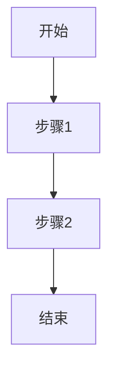

# 运营类文档规范

## 概述

本文档定义了 Open Design 项目中所有运营类文档的格式、结构和内容要求。运营类文档包括设计评审记录、开发者交付包、冲刺计划和工作流文档。

## 文档类型

### 1. 设计评审 (Design Critique)

#### 文件命名
- 格式：`design-critique-[project]-[date].md`
- 示例：`design-critique-dashboard-2026-04-23.md`

#### 必需字段

```markdown
---
critique_name: [评审名称]
project: [项目名称]
critique_type: [评审类型：desk/team/cross-team/stakeholder]
date: [日期]
facilitator: [主持人]
participants: [参与者]
---

# 设计评审：[评审名称]

## 评审目标
- [本次评审的目标]

## 设计师背景
- **设计师**：[设计师姓名]
- **设计目标**：[设计的目标]
- **约束条件**：[设计的约束]
- **目标受众**：[目标用户]
- **工作阶段**：[设计所处的阶段]

## 反馈需求
- [需要反馈的具体方面]

## 评审规则
- [评审的规则和期望]

## 评审过程

### 1. 展示 (5分钟)
- [设计师展示工作和目标]

### 2. 澄清 (5分钟)
- [理解问题，而非评判]

### 3. 反馈轮
- [结构化的反馈]

### 4. 讨论
- [对关键张力的开放对话]

### 5. 记录
- [记录决策和行动项]

## 反馈记录

### 反馈1：[反馈类型]
- **反馈者**：[反馈者姓名]
- **反馈格式**：I notice / I wonder / What if / I think because
- **内容**：[反馈的详细内容]
- **优先级**：[P0/P1/P2]

### 反馈2：[反馈类型]
- [同上]

## 心理学原则检查
- **认知负荷**：[设计是否遵循认知负荷理论]
- **希克定律**：[选项数量是否合理]
- **格式塔原则**：[视觉组织是否清晰]
- **损失厌恶**：[是否有保护机制]

## 决策
- [评审的决策]

## 行动项

### 行动项1
- **描述**：[行动项的描述]
- **负责人**：[负责人]
- **截止日期**：[截止日期]
- **状态**：[待处理/进行中/已完成]

### 行动项2
- [同上]

## 后续计划
- [后续的评审或行动计划]
```

#### 质量标准

- **建设性**：反馈建设性，非批评
- **具体性**：反馈具体，可操作
- **及时性**：评审及时，不影响进度
- **可追溯**：决策和行动项可追溯

### 2. 开发者交付包 (Developer Handoff)

#### 文件命名
- 格式：`handoff-[component]-[version].md`
- 示例：`handoff-button-v1.0.md`

#### 必需字段

```markdown
---
component_name: [组件名称]
version: [版本号]
handoff_date: [交付日期]
designer: [设计师]
developer: [开发者]
---

# 开发者交付包：[组件名称]

## 组件概述
- [组件的简要描述]

## 设计规范引用
- **DESIGN-SPEC.md**：[引用的设计系统规范章节]
- **tokens**：[引用的具体tokens]

## 视觉资源
- **设计稿链接**：[Figma/Sketch链接]
- **图标资源**：[图标文件链接]
- **图片资源**：[图片文件链接]

## 交互规范
- [交互行为的详细说明]

## 响应式断点
- [不同断点下的表现]

## 状态说明

### 默认状态
- [默认状态的说明]

### 悬停状态
- [悬停状态的说明]

### 按下状态
- [按下状态的说明]

### 禁用状态
- [禁用状态的说明]

## 可访问性要求
- **键盘导航**：[键盘支持说明]
- **ARIA标签**：[ARIA标签说明]
- **对比度**：[对比度要求]
- **焦点指示**：[焦点指示说明]

## 代码示例

### HTML
```html
[HTML代码示例]
```

### CSS
```css
[CSS代码示例，使用设计tokens]
```

### JavaScript
```javascript
[JavaScript代码示例]
```

## 测试清单
- [ ] 视觉还原度检查
- [ ] 交互行为验证
- [ ] 响应式测试
- [ ] 可访问性测试
- [ ] 浏览器兼容性测试

## 已知问题
- [已知的限制或问题]

## 变更历史
- [版本变更历史]
```

#### 质量标准

- **完整性**：包含开发所需的所有信息
- **准确性**：设计规范准确无误
- **可操作性**：开发者可以直接使用
- **可追溯性**：可以追溯到设计决策

### 3. 冲刺计划 (Sprint Plan)

#### 文件命名
- 格式：`sprint-plan-[sprint-number].md`
- 示例：`sprint-plan-sprint-1.md`

#### 必需字段

```markdown
---
sprint_number: [冲刺编号]
start_date: [开始日期]
end_date: [结束日期]
duration: [冲刺时长]
team_lead: [团队负责人]
---

# 冲刺计划：Sprint [编号]

## 冲刺目标
- [本次冲刺的目标]

## 冲刺范围

### 设计任务
- **任务1**：[任务描述]
  - **负责人**：[负责人]
  - **优先级**：[优先级]
  - **预估时间**：[预估时间]
  - **依赖**：[依赖关系]

- **任务2**：[任务描述]
  - [同上]

### 开发任务
- [同上]

### 研究任务
- [同上]

## 时间线

### Week 1
- [第一周的任务安排]

### Week 2
- [第二周的任务安排]

## 里程碑
- **里程碑1**：[里程碑描述] - [日期]
- **里程碑2**：[里程碑描述] - [日期]

## 风险和依赖
- **风险**：[潜在风险]
- **依赖**：[外部依赖]

## 成功标准
- [如何衡量冲刺的成功]

## 每日站会
- **时间**：[站会时间]
- **参与者**：[参与者]
- **格式**：[站会格式]

## 冲刺评审
- **评审日期**：[评审日期]
- **评审内容**：[评审内容]

## 回顾会议
- **回顾日期**：[回顾日期]
- **回顾内容**：[回顾内容]
```

#### 质量标准

- **明确性**：目标和范围明确
- **可执行性**：任务可执行
- **可追踪性**：进度可追踪
- **灵活性**：允许调整

### 4. 工作流文档 (Workflow)

#### 文件命名
- 格式：`workflow-[process-name].md`
- 示例：`workflow-design-review.md`

#### 必需字段

```markdown
---
workflow_name: [工作流名称]
process_type: [流程类型]
created_date: [创建日期]
---

# 工作流：[流程名称]

## 流程概述
- [流程的简要描述]

## 流程目标
- [流程的目标]

## 参与者
- **角色1**：[角色名称和职责]
- **角色2**：[角色名称和职责]

## 流程步骤

### 步骤1：[步骤名称]
- **执行者**：[执行此步骤的角色]
- **输入**：[步骤的输入]
- **输出**：[步骤的输出]
- **工具**：[使用的工具]
- **时间**：[预计时间]
- **验收标准**：[如何验收此步骤]

### 步骤2：[步骤名称]
- [同上]

## 流程图


## 决策点

### 决策1：[决策名称]
- **决策者**：[做出决策的角色]
- **决策标准**：[决策的标准]
- **分支**：[不同分支的处理]

## 工具和资源
- [工作流使用的工具和资源]

## 指标和度量
- [衡量工作流效果的指标]

## 持续改进
- [如何持续改进此工作流]

## 常见问题
- **问题1**：[常见问题和解决方案]
- **问题2**：[常见问题和解决方案]
```

#### 质量标准

- **清晰性**：每个步骤定义清晰
- **完整性**：覆盖整个流程
- **可重复性**：流程可重复执行
- **可优化性**：流程可以被优化

## 通用要求

### 文档格式
- 使用 Markdown 格式
- 包含 YAML front matter
- 使用清晰的标题层级
- 适当使用表格、列表、图表
- 使用 Mermaid 绘制流程图

### 版本控制
- 每次更新更新版本号
- 在文档末尾添加版本历史
- 重大变更记录变更原因

### 审核流程
- 运营文档需要经过团队评审
- 评审者检查文档的完整性和质量
- 评审意见记录在文档中

## 与设计系统规范的关系

运营类文档与设计系统规范（DESIGN-SPEC.md）的关系：

- **独立文档**：运营类文档保持独立，不纳入设计系统规范
- **执行关系**：运营文档执行设计系统规范
- **反馈关系**：运营反馈用于迭代设计系统规范
- **验证关系**：运营验证设计系统规范的可行性

### 设计评审与设计系统规范

- **检查清单**：设计评审使用设计系统规范作为检查清单
- **验证**：验证设计是否遵循设计系统规范
- **反馈**：评审反馈用于改进设计系统规范

### 开发者交付包与设计系统规范

- **引用**：交付包引用设计系统规范的 tokens
- **转换**：将设计系统规范转换为代码
- **验证**：验证代码实现是否符合设计系统规范

### 冲刺计划与设计系统规范

- **任务分解**：基于设计系统规范分解任务
- **优先级**：设计系统规范的优先级影响任务优先级
- **依赖**：设计系统规范的变更影响冲刺计划

## 模板文件

提供标准模板文件：
- `templates/design-critique-template.md`
- `templates/handoff-template.md`
- `templates/sprint-plan-template.md`
- `templates/workflow-template.md`
